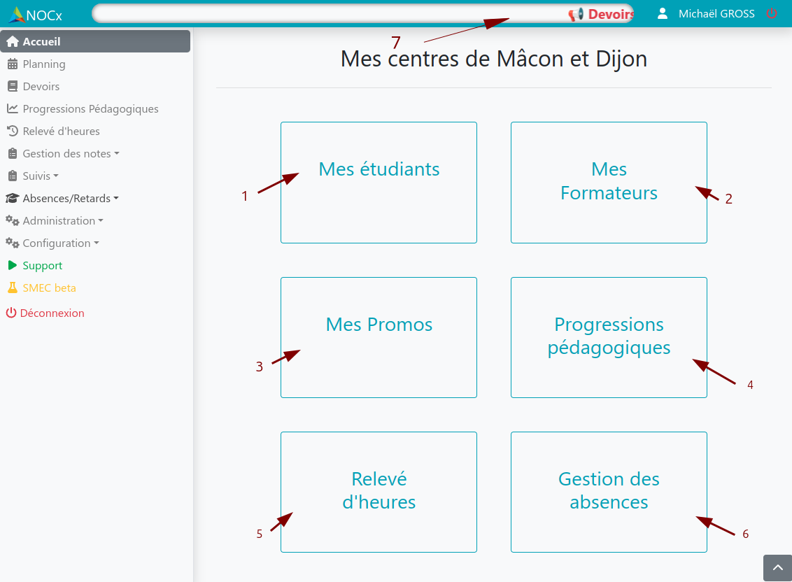
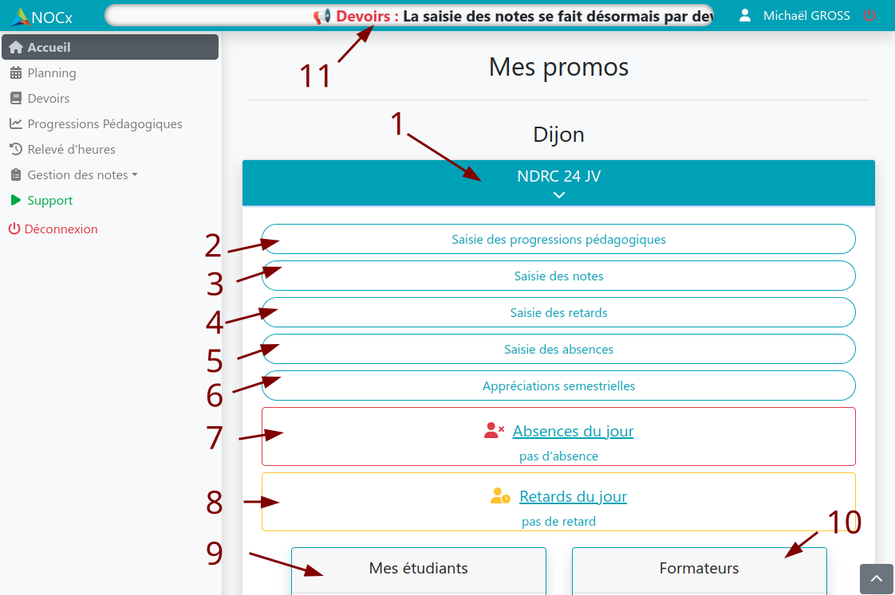
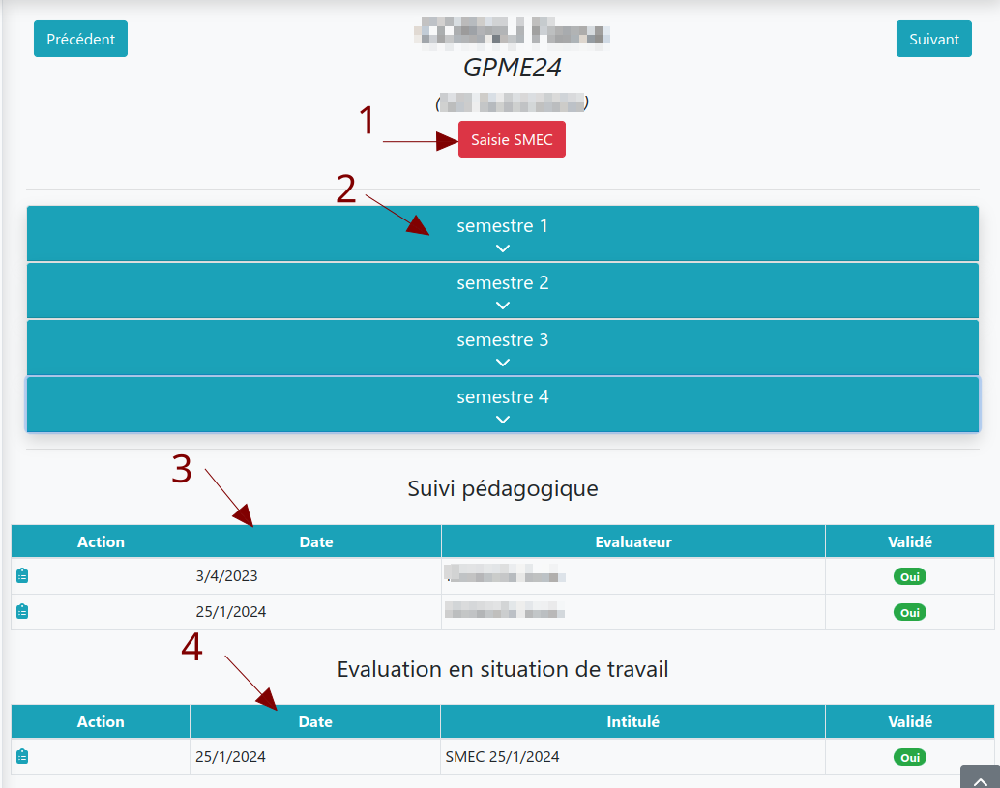
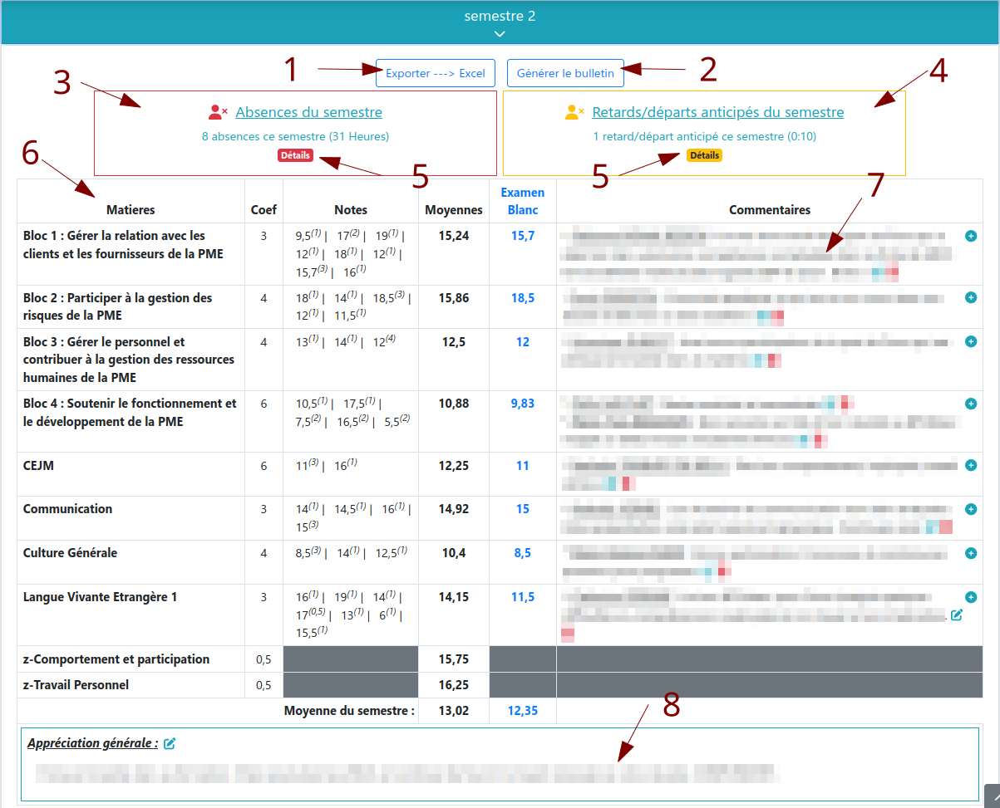

# Accueil

## Administrateur

:::info Légende

1. Lien vers Administration > Gestion des élèves
2. Lien vers Administration > Gestion des formateurs
3. Lien vers Administration > Gestion des promos
4. Lien vers Progressions pédagogiques
5. Lien vers Relevé d'heures
6. Lien vers Absences/Retards > Absences/Rattrpages
7. Message d'information

:::

## Formateur

:::info Légende

1. Choix de la promos
2. Saisie d'une progression pédagogique
3. Saise d'un devoir et de ses notes
4. Saisie des retards (déprécié pour les centres utilisant Edusign)
5. Saisie des Absences (déprécié pour les centres utilisant Edusign)
6. Sasie des appréciations semestrielles
7. Liste des absences du jour
8. Liste des retards du jour
9. Liste des étudiants
10. Liste des formateurs intervenants sur la promo
11. Message d'information

:::

## Étudiant et tuteur

### Vue globale

:::info Légende

1. Sasie du SMEC (Suivi Mensuel en Entreprise des Compétences)
2. Sélection du semestre
3. Liste des suivis Pédagogiques
4. Liste des SMEC

:::

### Vue détaillée

:::info Légende

1. Export du bulletin de notes au format excel
2. Export du bulletin de notes au format PDF
3. Récapitulatif des absences du semestre
4. Récapitulatif des Retards/départs anticipés du semestre
5. Affichage du détail des absences ou retards
6. Relevé de notes du semestre
7. Commentaires semestriels par matières
8. Commentaire général semestriel

:::
