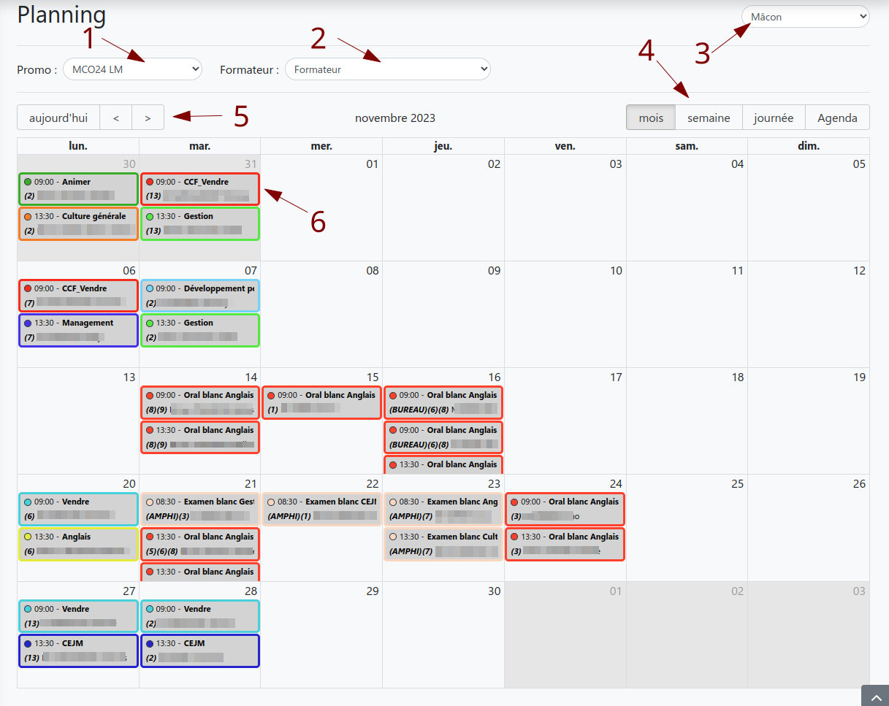

# Planning

:::warning
**Cette fonctionnalité est opérationnelle uniquement si la synchro avec Galia à été faite !**
:::

### Vue Administrateur

:::info Légende Administrateur

1. Choix de la promo à afficher
2. Choix du formateur à afficher
3. Choix du centre de formation à afficher

**Plus les élèments de la vue étudiant et formateur**

:::

### Vue Etudiant, Tuteur et Formateur

:::info Légende Etudiant, Tuteur et Formateur

4. Choix du mode d'affichage
5. Navigation dans les dates
6. Détail de la session (Heure de debut, matière, salle et le formateur) _infos provenant de Galia_

:::
